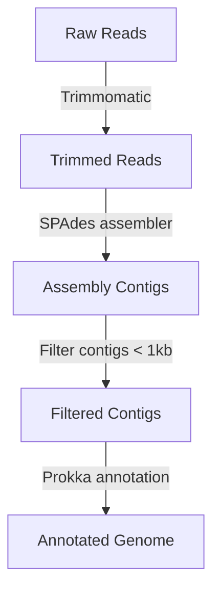

***WGS_Bscript***

---

**Simple script for bacterial whole genome sequences analysis**

This bash script is prepared for whole genome sequencing data analysis on the Compute Canada server. The target is to use only the tools in the Compute Canada module without installing extra libraries or tools and create a simple workflow for paired-end short-read sequence analysis, including QC, trimming, assembly, and annotation. The test was conducted in the Compute Canada Beluga Server.

---

**Workflow**



---

**Preparation:**

1. ***Create a directory to put your results and get its pathway.***
  
2. ***Collect or make your own primer file (it should be '.fa' or '.fasta' file) and get its pathway***
  
3. ***Modified bash script***
  
  Download the wgs_bscript. Then change the head of this job (You might need to change the time, memory and node depending on the number of sequences. But you need at least 150G for SPAdes, or you can change the setting in SPAdes)
  
  ```
  #!/bin/bash
  #SBATCH --account=your account name
  #SBATCH --time=48:00:00
  #SBATCH --job-name=the name of your job
  #SBATCH --output=%x-%j.out
  #SBATCH --mail-user=your email
  #SBATCH --mail-type=ALL
  #SBATCH --mem-per-cpu=186G  
  #SBATCH -n 2
  ```
  
  Provide the raw data directory
  
  ```
  raw_data_path=/path/to/your/raw/data
  ```
  
  Define your working directory: where you want to put your results
  
  ```
  path=/path/to/your/working/directory/
  ```
  
  Define your primer path and file.
  
  ```
  primer_path=/path/to/your/primer/yourprimerfilename.fa
  ```
  
  If your sequence does not end with " _R1_001.fastq.gz" or " _R2_001.fastq.gz", you also need to change the tag and format:
  
  ```
  #Define the tag of your sequence
  tag1="_R1_001"
  tag2="_R2_001"
  
  #Define the format of your sequence
  fo=fastq.gz
  ```
  
  ---
  
  **Notes**
  
  1. ***In this script, you can change all the versions of your tools from line 11 to 20.***
    
  2. ***In this script, you should change all the parameters of the tools based on your needs.***
    
  3. ***All the quality control results will be put in QC folder.***
