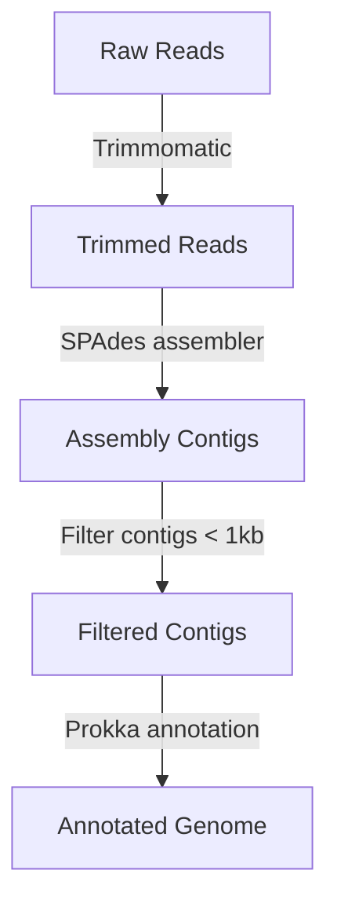

# WGS_Bscript

**Simple script for bacterial whole genome sequences analysis**

This bash script is prepared for whole genome sequencing data analysis on the Digital Research Alliance of Canada server. The target is to use only the tools in the Compute Canada module without installing extra libraries or tools and create a simple workflow for paired-end short-read sequence analysis, including QC, trimming, assembly, and annotation. The test was conducted in the Compute Canada Beluga Cluster. (The head of the scripts might be differ from different cluster, e.g. Niagara Cluster)

---

### Workflow



---

### Preparation:

1. ***Create a directory to put your results and get its pathway.***
  
2. ***Collect or make your own primer file (it should be '.fa' or '.fasta' file) and get its pathway***
  
3. ***Modified bash script***
  
  Download the wgs_bscript. Then change the head of this job (You might need to change the time, memory and node depending on the number of sequences. But you need at least 150G for SPAdes, or you can change the setting in SPAdes)
  
  ```
  #!/bin/bash
  #SBATCH --account=the name of your account
  #SBATCH --time=48:00:00
  #SBATCH --job-name=the name of your job
  #SBATCH --output=%x-%j.out
  #SBATCH --mail-user=your email
  #SBATCH --mail-type=ALL
  #SBATCH --mem-per-cpu=186G  
  #SBATCH -n 2
  ```
  
  Provide the raw data directory at line 26
  
  ```
  raw_data_path=/path/to/your/raw/data
  ```
  
  Define your working directory at line 29: where you want to put your results
  
  ```
  working_path=/path/to/your/working/directory/
  ```
  
  Define your primer path and file at line 32.
  
  ```
  primer_path=/path/to/your/primer/yourprimerfilename.fa
  ```
  
  If your sequence does not end with " _R1_001.fastq.gz" or " _R2_001.fastq.gz", you also need to change the tag (at line 35 and 36) and format (at line 39):
  
  ```
  #Define the tag of your sequence
  tag1="_R1_001"
  tag2="_R2_001"
  
  #Define the format of your sequence
  fo=fastq.gz
  ```
  
  ---
  
  **Notes**
  
  1. ***In this script, you can change all the versions of your tools from line 11 to 20.***

  2. ***In this script, we will rename the raw reads, only the part before the first "_" as the sample name. If you do not want to rename or your naming system is different, please modify or delete line 44 to 55. (e.g. "J-D0-22_S35_L001_R2_001.fastq.gz" to "J-D0-22_R2_001.fastq.gz").***
    
  3. ***In this script, you should change all the parameters of the tools based on your needs.***

  ---
### Usage:
You can directly upload the modified script, or;
Use the "nano" command to create your script and directly paste the commands in the script:

```
# Go to the working directory or anydirectory you want to put your script
nano WGS_Bscript
# After creating the script, copy and paste your modified script and save it with "CTRL + o".
```

If you want to run the pipeline on Compute Canada, execute the following:

```
sbatch WGS_Bscript
```

### Directory Structure and Results:

1. **Raw Reads Quality Control**:
  
  - **FastQC Results**: Quality control reports for raw reads.
    - `$working_path/result/QC/Rawreads/FastQC_result`: Contains FastQC reports for raw reads.

2. **Trimmed Reads**:
  
  - **Trimmed Paired-End Reads**: Trimmed paired-end reads after adapter removal and quality trimming.
    - `$working_path/result/Trim/both_sequence`: Contains both paired and unpaired trimmed reads.
    - `$working_path/result/Trim/trimmed_paired_sequence`: Contains only paired trimmed reads.
3. **Trimmed Reads Quality Control**:
  
  - **FastQC Results**: Quality control reports for trimmed reads.
    - `$working_path/result/QC/TrimQC_result`: Contains FastQC reports for trimmed reads.
      
4. **SPAdes Assembly**:
  
  - **Assembly Results**: Assembled contigs from SPAdes.
    - `$working_path/result/SPAdes/result`: Contains SPAdes assembly results for each sample.
    - `$working_path/result/SPAdes/all_contigs`: Contains all contigs from the SPAdes assembly.
      
5. **Quality Assessment of Contigs**:
  
  - **Quast Results**: Quality assessment of assembled contigs using Quast.
    - `$working_path/result/QC/Assembly/Quast/Contigs`: Contains Quast reports for the assembled contigs.
      
6. **Filtered Contigs**:
  
  - **Filtered Contigs**: Contigs filtered to remove those shorter than 1kb.
    - `$working_path/result/Assembly/Filtered_Contigs`: Contains filtered contigs for each sample.
      
7. **Quality Assessment of Filtered Contigs**:
  
  - **Quast Results**: Quality assessment of filtered contigs using Quast.
    - `$working_path/result/QC/Assembly/Quast/Filtered_Contigs`: Contains Quast reports for the filtered contigs.
8. **Coverage Calculation**:
  
  - **BBMap Results**: Coverage calculation and pileup reports using BBMap.
    - `$working_path/result/QC/Assembly/BBmap`: Contains BAM files and pileup reports for each sample.
    - `$working_path/result/QC/Assembly/BBmap/pileup_reports`: Contains individual pileup reports.
    - `$working_path/result/QC/Assembly/BBmap/pileup_reports/pileup_summary.txt`: Combined summary of all pileup reports.
    - '$working_path/result/QC/Assembly/BBmap/covstats_reports':Contains summary statistics of the coverage for the entire genome.
    - '$working_path/result/QC/Assembly/BBmap/covstats_summary.txt': Contains the coverage statistics for all samples.
      
9. **Annotation**:
  
  - **Prokka Results**: Annotation results using Prokka.
    - `$working_path/result/Prokka`: Contains Prokka annotation results for each sample.
    - `$working_path/result/QC/Prokka`: Contains a summary CSV file with counts of contigs, bases, CDS, tRNA, and tmRNA for each sample.

### Expected Output Files:

- **FastQC Reports**: `.html` and `.zip` files for each raw and trimmed read.
- **Trimmed Reads**: `.fastq.gz` files for paired and unpaired trimmed reads.
- **SPAdes Assembly**: `contigs.fasta` files for each sample.
- **Quast Reports**: `.html` and other summary files for contig quality assessment.
- **Filtered Contigs**: `filtered_contigs.fasta` files for each sample.
- **BBMap Results**: `.bam` and `.txt` files for coverage calculation and pileup reports.
- **Prokka Annotation**: Various annotation files and a summary CSV file.
